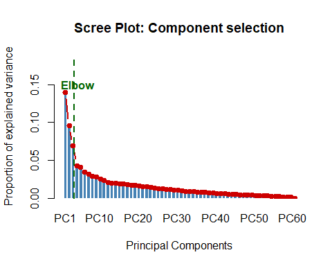
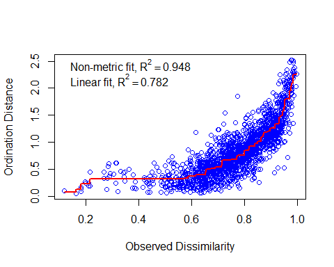
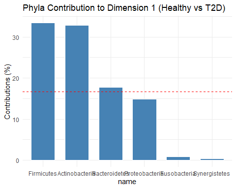

# Metagenomic-Insights-into-Type-2-Diabetes-A-Multivariate-Analysis-in-R
This repository contains a multivariate statistical analysis of the human gut microbiome associated with Type 2 Diabetes (T2-D). 

## Project Summary and goal
The primary objective of this analysis is to acquired already proccessed **relative abundances of bacteria present in the gut microbiota of control subjects and patients with T2-D**. Multiple **ecological analyses** will be conducted, including the **Shannon index**. Particular emphasis is placed on the **application of various multivariate analyses**, including **Principal Component Analysis (PCA), non-Metric Multidimensional Scaling (nMDS), and Correspondence Analysis (CA)**. 

**Dataset Highlights**: Analysis of a subset of 30 healthy controls and 30 patients from the original study. This study uses fecal samples to investigate the gut microbiome.
**Conditions:** Comparison between Healthy Controls and T2-D patients.
**Technology:** Metagenome-Wide Association Study(MGWAS) based on deep shotgun sequencing of the gut microbial DNA (Illumina GAIIx and HiSeq 2000) 

## Key Steps
* **Data Preprocessing:** acquisition with Bioconductor 
* **Ecological parameters:** Visualizing Species Richness and Shannon index within each group
* **Outlier detection**: using Euclidean and Mahalanabois distances
* **Data normalization**: Centering, scaling, and logarithmic transformation
* **Exploratory Data Analysis:** PCA, nMDS (Kruskal method with Bray-Curtis distance) and CA.
* **Comparison with the original article** : possible differences, advantages and limitations of our study

## Analysis overview
The control cohort and the patient cohort show slight differences in their ecological parameters (similar Shannon index) and species richness (although there are significant differences in the composition of the dominant bacteria within each group). 

The PCA score plot shows a clear overlap between the two populations. To select the principal components, we used the elbow method: 

> We continued the analysis with the first three components. 

Since this is a microbiome study, we decided to apply an nMDS technique using Bray-Curtis distances. The reduction to a 2-dimensional scale shows a good profile. 

> Shepard plot. The points form a well-defined line and upward curve, implying that the two-dimensional nMDS translates biological differences into visual distances.

Finally, using correspondence analysis, we learned a bit more about the specific contribution of each bacterial species: 

> With a total inertia value of 0.0204, we see that there are differences between healthy controls and diabetic patients. The contribution plot shows that *group differences are driven primarily by bacteria from the phyla _Firmicutes_ and _Actinobacteria_**.

## Software & Libraries
This pipeline is built on the Bioconductor ecosystem for genomic data science and the primary frameworks used are: 
* **Language:** R
* **Bioinformatics:** Bioconductor:
  * curatedMetagonicData, SummarizedExperiment: for data acquisition and object manipulation.
  * vegan: central study of ecological parameters like Shannon index.
  * robusbase: for Mahalanabois distance calculation.
  * FactoMineR, factoextra: calculations and visualizations of CA.
* **Data manipulation & Visualization:** `tidiverse`(`ggplot2` and `tdyr`) among others. 
  
Reproducibility Note: A comprehensive list of all loaded packages, versions, and the computational environment is provided in the Session Information section at the end of the final report.

## Repository Structure
* This data comes from a published study: Qin J., *Nat.*, 2012. and complete data is available in **GigaDB under accesion number [100036](https://www.ncbi.nlm.nih.gov/geo/query/acc.cgi?acc=GSE161731](https://gigadb.org/dataset/100036))**.
* [Subset of the data (.RData)](QinJ_2012.RData): the subset of data from the total cohort of patients included in this study
* [Main Analysis Script (R)](Analysis_script.Rmd): clean and commented code. 
* [Full Research Report (HTML)](Full_Research_Report.html): interactive report with all visualizations and statistical tables.
* [Executive Summary (PDF)](executive_summary.pdf): scientific summary of findings for clinical stakeholders with minimal code requirements.
* [Plots](plots): folder with all the individual images and figures inside the project.
* [Session Info (txt)](session_info.txt): complete information about the used environment. 

---
*Developed as part of my technical portfolio in Biostatistics and Genomic Data Science.*
